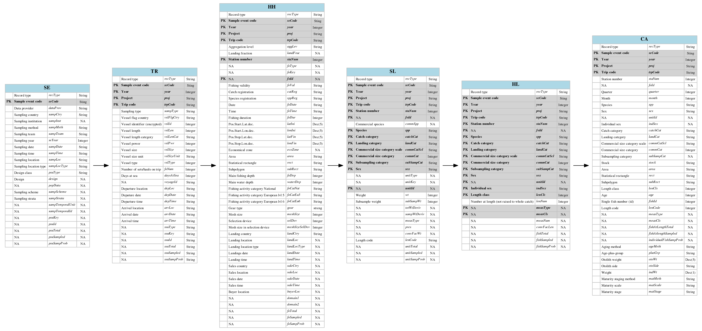

#Framework

Fishery data have to be inspected 
in order to detect errors before to use them in the stock assessment procedure [@chen2003].
Finding and correcting errors is one of the first tasks one needs to perform on a dataset in this case.
Currently these checks are made at national level using mainly manual methods 
(based on graphs and numerical summary, see @vigneau2007 for example).
When  the  amount  of  data  is  large (as it will become with the implementation of the regional database)
manual methods are (1) too time consuming and (2) are difficult to track in time (when and how the corrections
were made).  Hence automated procedures are needed and participate intrinsically to build the data quality. 

This document is a tutorial related to the use of the R `fishPifct` package to assess data quality on fishery
sampling data.
The `fishPifct` package was developped for the work package 4 of the fishPi project (project DG-MARE 2014/19 WP4). 
Its main objectives are to provide to the end users a 
framework to assess the quality of sampling data related to fishery.

##Data format specification

This framework concerns sampling data and leans on the `csPi` format in term of
data structure. The `csPi` format is a format under development based on the `fishFrame` format.
The fishFrame format is used in the Regional Database and by the COST packages (a collection of tools to deal with
data compilation, @cost2009). Its complete definition is given in @fishframe2009.
An update of this format, called csPi, is in discussion since 2014 [@wkrdb2014], and the version 2.1 of this format
is used in this report.
Tools to export `fishFrame` files in `csPi` as provided. 
And in order to insure a wide range of application, most of the packages functions works on `csPi` and `fishFrame`
objects.

##Methodology

This framework follows the recommandation
of the reproducible research statment [@gentleman2004].
Consequently this report is self-consistent: the code used to process and to analyse
the sampling data are embedded in the report itself.
An effort was made to select computing tools who give
to the users the ability to reproduce the analyses using only a computer and an
internet connection (for installation purposes mainly). 
Therefore all the tools are open source software, available
free of charges, and running on the three main operating systems available
nowadays (Linux, Windows and Mac OS). 

##Software

Coding and analyses are carried out using the R environment [@r2016].
R[^noteR] is a free software environment for statistical computing
and graphics. The reproducibility of the results presented in this report
relies on the use of a dialect of the Mardown language called Pandoc for word
processing using the Knitr R package.
Markdown is a plain text formatting syntax designed so that it can optionally be
converted to HTML using a tool by the same name.
Pandoc[^noteMd] is a Markdown dialect which extends the conversion capability to
word processing file (docx, doc and odt), html and pdf, among other formats.
Pandoc understands a number of markdown syntax extensions, including
document metadata (title, author, date), footnotes, tables, figures and
references.
Knitr[^noteKnitr] is an R package (a set of functions extending the R capabilities).
With this package, the R code used to process and analyze the data 
is included directly in the report. Results are then produced
dynamically. This framework has demonstrated the capacity to improve
the conduct and the presentation of data analysis in a way that another person
can understand and replicate [@baumer2014].

[^noteR]: <http://www.r-project.org/>.

[^noteMd]: <http://johnmacfarlane.net/pandoc/>.

[^noteKnitr]: <http://yihui.name/knitr/>.

[^noteRstudio]: <http://www.rstudio.com/>.

For example, if the calculus of 1+1 is needed, the code to compute it is
written in the report using special hooks, as in this simple
example:

```R
'''{r test00,warn=FALSE,cache=TRUE,echo=TRUE}
#comment: addition example.
1+1
'''
```

This code is evaluated during the compilation of the report by the knitr command
and it prints the following result:

```{r test01,warn=FALSE,cache=TRUE,echo=TRUE}
#comment: addition example.
1+1
```

The result is 2.
In this tutorial all the numerical values, tables and figures
are produced following this procedure.
The scripts and the report can be elaborated in a single
integrated development environment (IDE), called Rstudio[^noteRstudio].
It includes a console and a syntax-highlighting editor that supports direct code
execution, as well as tools for plotting, debugging and writing report.
Consequently, all the tools and code presented here are already available to the end user.

##Installation

This package is available  
in the [fihPifct repository](https://github.com/lodbk/fishPifct/tree/master/vignettes) on
Github.
The installation procedure is simple as :

```{r,eval=FALSE}
install.packages("devtools")
library(devtools)
install_github("ldbk/fishPifct")
```

###Issues

Technical problem support during the installation process (R version, missing packages...) is far
beyond the scope of this tutorial. In case of problem, please contact your IT support.

Some users reported issues with the openxlsx package installation 
(needed to import and export csPi and csData object in excel file).
Please read carefully the error messages R gives to you (the way to fix these errors are explained to you 
in these messages).
The average procedure to fix them should be something like:

```{r,eval=FALSE}
install.packages("installr")
installr::installr("Rtools")
```
During the installation, tick the PATH modification option.
Then, restart your computer.

###COST library

If needed, COST related package (for windows) can be found here :

- https://dl.dropboxusercontent.com/u/6181692/COSTcore_1.4-0.zip
- https://dl.dropboxusercontent.com/u/6181692/COSTdbe_1.4-1.zip
- https://dl.dropboxusercontent.com/u/6181692/COSTeda_1.4.0.zip

and here for Unix system : 

- https://dl.dropboxusercontent.com/u/6181692/COSTcore_1.4-0.tar.gz
- https://dl.dropboxusercontent.com/u/6181692/COSTdbe_1.4-1.tar.gz
- https://dl.dropboxusercontent.com/u/6181692/COSTeda_1.4.0.tar.gz

The COST manuel can be downloaded here :

- https://dl.dropboxusercontent.com/u/6181692/COST%20User%20Manual%20V1_1.pdf

#Data 

##Format specification

In this tutorial, only the main characteristics of this format are illustrated.
A detailed version of the `csPi` format specifications is given in @wkrdb2014 and
in the help page of the `csPi` function.

`csPi` is an S4 object containing 10 slots :
```{r}
library(pander);library(fishPifct)
pander(format_definition_csPi$slots,split.table=Inf)
```

The slots `desc`, `popData`, `design` are not mandatory and serve as descriptive fields for
future applications. 

The slots `classVersion` provides the version number of the csPi format. This format is still
in development, and keeping the format version will insure retrocompatibility with the future
development of the package.
The slots hold the sampling information : the sampling events description (`se`), 
the trip information (`tr`), the hauls caracteristics (`hh`), the species sampled (`sl`) 
and the correspondings length measurments (`hl`), and the biological parameters (`ca`).
Each of these slots is a `data.frame` who lists the different parameters requested for each sample.
Type of the vessel, its characteristic, the fishing location and the quantity landed, 
the scientific name of the sampled species, the length class of the
fishes, the age, etc... are reported in these tables. These variables can be numeric, text or codelist.
For each table, a group of variables represent the primary key and insure the links with the other tables.
The next figure gives an overview of the structure of the table.




##Example dataset
The data are generated based on the sole dataset coming from the COST 
package. The fishFrame COST format is exported in the csPi format using the function `csDataTocsPi`:
```{r}
library(fishPifct)
data(sole)
sole <- csDataTocsPi(sole.cs)
head(sole)
```
The csPi object is named sole in our example.

##Handling csPi ojects
A collection of methods and functions gives to the user the ability to explore and visualize a csPi objects:
```{r}
methods(class="csPi")
#subset csPi object
#?csSubset
```
Their behaviours are similar to the generic one (ie `dim` gives the dimension of all the `csPi` slots). 

##Import and export in spreadsheet

Fishing data rely usually on national database. Correction procedures in these systems can be a tedious work, not 
really in accordance to quick corrections (during working groups, to harmonize datasets between countries for example).
Manual data corrections are difficult and spreadsheet is nowadays the common tools to correct locally the data.
A local import/export procedure is available to export the `csPi` in excel file format.
Thus, the user can use a spreadsheet to do some corrections in the tables and then import directly the corrected tables in
a `csPi` object in R.

In this package the `import` and `export` functions do these transformation easily:
```{r}
export(sole,file="sole.xlsx",type="xlsx")
#use a spreadsheet to open the sole.xlsx file and do some corrections if needed
#save the file, and import it in R with:
solecorrected<-importxlsx(file="sole.xlsx")
```

#Data quality checks

##Data structure checks

A seminal step in data quality is to check the structure of the data. 
The structure check includes the ordered verification of :

- the objects' slots: name, existence, mandatory or not.
- the slots' tables: dimension, variables names, mandatory or not, 
  uniqueness of the primary keys if applicable.  
- the tables'variables: their types - numeric (integer or real, lower and upper limits), character, codelist (a list of authorized values)-, nullable, mandatory or not.

The data structure definition is given for `csPi` objects by the list `format_definition_csPi`.
This list is built from the excel file `format_definition_csPi.xlsx` in the data directory of the
installation directory of the package. Providing the excel file gives to the end user the possibility to modify
the data structure check (for example the lower and upper limits of the length class, or a limited list of métier).

###Slot definition

A slot definition is a table reporting the characteristics of a given slot :

|slot_name | mandatory | definition_table |
|----------|-----------|------------------|
|base |  TRUE |slot_base|

Here the slot names `base` is mandatory and its definition is given
by the table `slot_base`. During the structure check, each slot is checked against its
definition given by the structure definition list. 

###Table definition

A table definition is a table reporting the characteristics of a given table.
For example here, the first 8 lines of the `tr` table definition :

```{r}
library(pander);library(fishPifct)
pander(format_definition_csPi$slot_tr[1:8,],split.table=Inf)
```

Each table's column is checked against its definition. For example, the `trpCode` variable has to be 
non nullable, is mandatory and is part of the primary key of the `tr` table. It is a text variable (`category`),
and its category definition is referenced in the `type_trpCode` of the definition file (or the excel sheet with
this name). 

###Variable checks

After the table definition, each variable are checked according to their types.
For example in the previous table `vslFlagCtry` is non nullable, mandatory and is not included in the primary key. The variable's type is a codelist, and the corresponding authorized value are registered in the `codelist_type` list of the format description, namely the list `codelist_ctry` (here the first 10 lines):

```{r}
pander(format_definition_csPi$codelist_ctry[1:10,],split.table=Inf)
```

This list is the list of the ISO 3166-1 alpha-3 country codes.
Limiting this list strengths the data quality check, according to the end user needs.

For the variables with a numeric type, the `numeric_type` list of the data definition brings information related to the numerical limits and if the numbers are integer (number of samples, age...) or real (probability...).

For example here, the first 8 lines of the `numeric_type` table definition:

```{r}
library(pander);library(fishPifct)
pander(format_definition_csPi$numeric_type[1:8,],split.table=Inf)
```

In this example, `year` is an integer between 1900 and 2020.
As previously stated the modification of the data structure is open to the end user needs.

###Notes

The data structure checks were developped by the sister project of fishPi 
related to the Mediterranean area, for fishFrame object
(https://git.outils-is.ird.fr/billet/SDEFQuality/wikis/home).
Consequently, this data structure check is applicable to any object structure, and it can be
extended to landings or effort file in a near future for example.

###Outputs

The results of the data structure checks are given in a report summarizing all the checks, 
if these checks pass, and why.
Using the `sole` dataset previously loaded:
```{r}
#generating a report in an R object
structurecheck<-validateData(obj=sole,formatDb=format_definition_csPi,report="list")
```
The meta information related to the check are:
```{r}
pander(structurecheck$meta,split.table=Inf)
```

The 10 first lines of the slots checks are:
```{r}
pander(structurecheck$struct[1:10,],split.table=Inf)
```

The 10 first lines of the variables checks are:
```{r}
pander(structurecheck$data[1:10,],split.table=Inf)
```

The tables are explicits and doesn't need any comments.
To generate a complete report in pdf or html format :

```{r}
#generating a pdf report
renderValidationReport(obj=sole,formatDb=format_definition_csPi,
		       title="test",reportFormat="pdf")
#a copy of this report can be found in
system.file('data', 
'dataValidationReport_20160518_235140_29d51c808f9b.pdf',
	    package='fishPifct')
```

###Consistency check

In this section, the consistency of the information between the 'csPi' slots is checked, e.g. identification of trips without fishing operations.
To do so, the function `consistency` performs hierachical anti jointure between related table and generates
a simple table reporting the `trpCode` who have to be checked between the tables:

```{r}
#consistency check generating a pdf report
consistencycheck<-consistency(sole)
pander(consistencycheck,split.table=Inf)
```
In our sole example, no consistency errors were detected.

##Outliers detection

The  literature  on  outliers  is  extensive, and cover all the areas of science, 
but determining whether or not
an observation is an outlier is ultimately a subjective exercise and hence makes automation a difficult task.
Here we will use the definition of @barnett1994 for outlier:
"Indicate that an outlying observation, or outlier, is one that
appears to deviate markedly from other members of the sample in which it occurs".
Outlier detection methods can be divide between univariate methods (looking at only one
variable) and multivariate methods (looking at more than one variable and their
relationships). For example univariate methods spot 
observations reported in tons instead of kilos in landings, while multivariate methods can identify
wrong weigths in a size-weight relationship.
Then outlier detection methods can be categorized between
parametric (statistical)
methods and non-parametric methods that are model free.
Statistical parametric methods either assume a known underlying distribution of the data or, at
least, they are based on statistical estimates of unknown distribution parameters. Observations
that deviate from the model assumptions are flagged as outliers. 
Here we focus on two generic non parametric methods for numerical and non numerical univariate data.
The function `outliers` do the outliers detection for a `csPi` object.

###Numeric variables
The adjusted outlyingness index is used to detect outliers. It's a non parametric methods, adapted to
skewed data.
The function `adjOutliness` of
the package `robustBase` is used. More details of this method can be found in the help page of
this function.
An example on the fishing duration (variable `foDur` of slot `hh`):
```{r}
tabaoutlier<-outliers(sole,slot="hh",var="foDur")
```
High fishing duration values are flagged as outliers, as presented in the figure.
The function output gives to the user the complete lines who includes the outliers:
```{r}
#10 first lines and 5 first columns of the outliers
pander(tabaoutlier[1:10,1:5],split.table=Inf)
```

###Text and codelist variables 
For a non-numerical variable, the outliers are detected using the occurence of the modality of the value,
expressed in percentage and a treshold (by default 1%). If a modality is expressed less than this treshold,
an outlier is considered detected. The treshold can be fixed by the user.
Here an example using the statistical rectangle fished :

```{r}
tabaoutlier<-outliers(sole,slot="hh",var="rect")
```
Rare fished rectangle are flagged as outliers.
The function output gives to the user the complete lines who includes the outliers:
```{r}
#10 first lines and 5 first columns of the outliers
pander(tabaoutlier[1:10,1:5],split.table=Inf)
```
These fonctions are generic and can be applied to the whole set of variables of a `csPi` object.

##Plots

###Maps
The function `csMap` gives the ability to the user to map easily a variable over the ICES 
statistical rectangle.
```{r}
 csMap(sole,"hh","foDur","tile","sum")
 csMap(sole,"hh","foCatEu5","bubble")
 csMap(sole,"hl","lenNum","tile","sum")
 csMap(sole,"tr","daysAtSea","bubble","sum")
 csMap(sole,"tr","vslId","bubble","n_distinct")
```

###Generic functions
The function `lengthHist` plots histograms of the length frequency data from the hl table of csPi object. 

```{r}
 lengthHist(sole)
```
The function `agelenPlot` plots age given length from the ca table of a `csPi`object.
```{r}
 agelenPlot(sole)
```

# About this vignette

This vignette was built using the vignette engine `knitr::rmarkdown`
in the **knitr** package. You can find the source
in the [fihPifct repository](https://github.com/lodbk/fishPifct/tree/master/vignettes) on
Github, or if the `fishPifct` package is installed on your computer:

```{r, eval=TRUE}
system.file('doc', 'tutorial.Rmd', package='fishPifct')
```

#References

